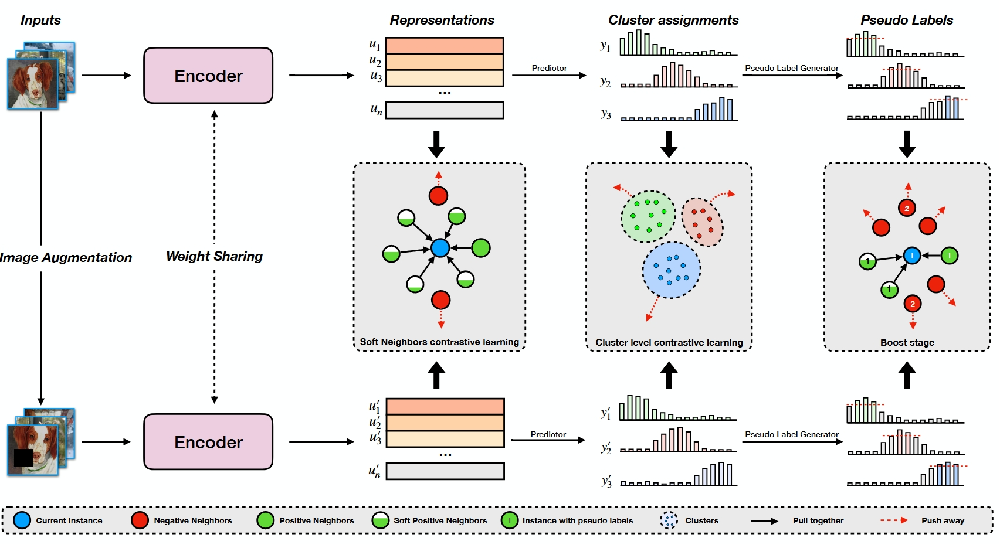
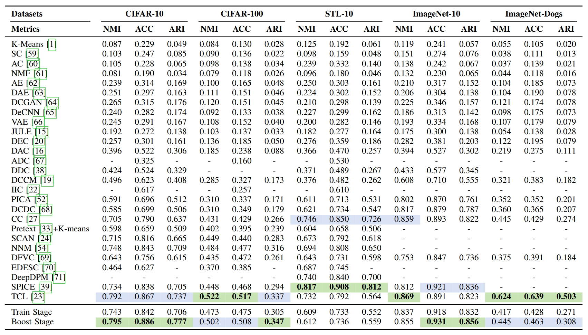

# Soft Neighbors Supported Contrastive Clustering

## Introduction




Existing deep clustering methods leverage contrastive or non-contrastive learning to facilitate downstream tasks. Most contrastive-based methods typically learn representations by comparing positive pairs (two views of the same sample) against negative pairs (views of different samples). However, we spot that this **hard treatment** of samples ignores inter-sample relationships, leading to class collisions and degrade clustering performances. In this paper, we propose a soft neighbor supported contrastive clustering method to address this issue. Specifically, we first introduce a concept called _perception radius_ to quantify similarity confidence between a sample and its neighbors. Based on this insight, we design a two-level soft neighbor loss that captures both local and global neighborhood relationships. Additionally, a cluster-level loss enforces compact and well-separated cluster distributions. Finally, we conduct a pseudo-label refinement strategy to mitigate false negative samples. Extensive experiments on benchmark datasets demonstrate the superiority of our method.

## Experimental Results
Our results on  whole five datasets:



## Run
### Requirements
Please refer to [requirements.txt](./requirements.txt) for more details.
### Usages


#### Pre-Train Stage
We can directly use the pre-text model from [SCAN](https://github.com/wvangansbeke/Unsupervised-Classification). Then, we only need to generate the neighbors by the code 

`python simclr.py --config_env configs/env.yml --config_exp configs/pretext/simclr_cifar10.yml`

#### Train Stage
Next, we run the code: 

`python scan.py --config_env configs/env.yml --config_exp configs/scan/scan_cifar10.yml --gpus 0 (--seed 1234)`.

#### Boost Stage
For Boost Stage, run the following code:
`
python boosting.py --config_env configs/your_env.yml --config_exp configs/boosting/selflabel_cifar10.yml
`


## Citation
If you use our code, please cite our work as:
```
@article{duan2025soft,
  title={Soft Neighbors Supported Contrastive Clustering},
  author={Duan, Yu and Chen, Huimin and Zhang, Runxin and Wang, Rong and Nie, Feiping and Li, Xuelong},
  journal={IEEE Transactions on Image Processing},
  year={2025},
  publisher={IEEE}
}
```
